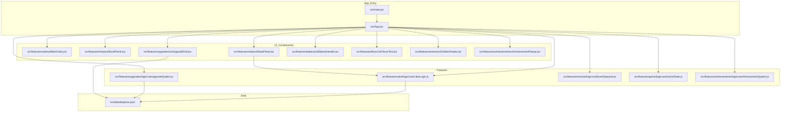

# Current Dependency Graph

> Auto-generated based on source imports.

```mermaid
graph TD
    subgraph App_Entry
        main[src/main.jsx] --> App[src/App.jsx]
    end

    subgraph Features
        App --> useCakeLogic[src/features/cake/logic/useCakeLogic.js]
        App --> useUpgradeSystem[src/features/upgrades/logic/useUpgradeSystem.js]
        App --> useEventSpawner[src/features/events/logic/useEventSpawner.js]
        App --> useGameState[src/features/game/logic/useGameState.js]
        App --> useAchievementSystem[src/features/achievements/logic/useAchievementSystem.js]
    end

    subgraph UI_Components
        App --> MainCake[src/features/cake/ui/MainCake.jsx]
        App --> StorePanel[src/features/shop/ui/StorePanel.jsx]
        App --> UpgradeGrid[src/features/upgrades/ui/UpgradeGrid.jsx]
        App --> StatsPanel[src/features/stats/ui/StatsPanel.jsx]
        App --> BakeryHeader[src/features/bakery/ui/BakeryHeader.jsx]
        App --> FlavorText[src/features/flavor/ui/FlavorText.jsx]
        App --> GoldenFloater[src/features/events/ui/GoldenFloater.jsx]
        App --> AchievementPopup[src/features/achievements/ui/AchievementPopup.jsx]
    end

    subgraph Data
        useCakeLogic --> balanceData[src/data/balance.json]
        useUpgradeSystem --> balanceData
        UpgradeGrid --> balanceData
        StatsPanel --> useCakeLogic
    end
```
