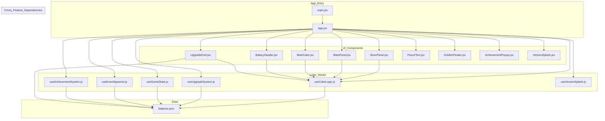

# Current Dependency Graph

> Auto-generated based on source imports. Last updated: 2025-12-09

```mermaid
graph TD
    subgraph App_Entry
        main[main.jsx] --> App[App.jsx]
    end

    subgraph Logic_Hooks
        App --> useCakeLogic[useCakeLogic.js]
        App --> useUpgradeSystem[useUpgradeSystem.js]
        App --> useEventSpawner[useEventSpawner.js]
        App --> useGameState[useGameState.js]
        App --> useAchievementSystem[useAchievementSystem.js]
        App --> useVersionSplash[useVersionSplash.js]
    end

    subgraph UI_Components
        App --> MainCake[MainCake.jsx]
        App --> StorePanel[StorePanel.jsx]
        App --> UpgradeGrid[UpgradeGrid.jsx]
        App --> StatsPanel[StatsPanel.jsx]
        App --> BakeryHeader[BakeryHeader.jsx]
        App --> FlavorText[FlavorText.jsx]
        App --> GoldenFloater[GoldenFloater.jsx]
        App --> AchievementPopup[AchievementPopup.jsx]
        App --> VersionSplash[VersionSplash.jsx]
    end

    subgraph Data
        useCakeLogic --> balanceData[balance.json]
        useUpgradeSystem --> balanceData
        useGameState --> balanceData
        useEventSpawner --> balanceData
        useAchievementSystem --> balanceData
        UpgradeGrid --> balanceData
    end

    subgraph Cross_Feature_Dependencies
        StorePanel --> useCakeLogic
        StatsPanel --> useCakeLogic
        MainCake --> useCakeLogic
        BakeryHeader --> useCakeLogic
        UpgradeGrid --> useCakeLogic
    end
```
