# Current Dependency Graph

> Auto-generated based on source imports. Last updated: 2025-12-10T16:39:00Z

```mermaid
graph TD
    subgraph App_Entry
        main[main.jsx] --> EventOverlay[EventOverlay.jsx]
        EventOverlay --> App[App.jsx]
    end

    subgraph Logic_Hooks
        App --> useCakeLogic[useCakeLogic.js]
        App --> useUpgradeSystem[useUpgradeSystem.js]
        App --> useEventSpawner[useEventSpawner.js]
        App --> useEventStore[useEventStore.js]
        App --> useGameState[useGameState.js]
        App --> useAchievementSystem[useAchievementSystem.js]
        App --> useVersionSplash[useVersionSplash.js]
    end

    subgraph Mobile_Navigation
        App --> useIsMobile[useMediaQuery.js]
        App --> useMobileNav[useMobileNav.js]
        App --> MobileTabBar[MobileTabBar.jsx]
    end

    subgraph UI_Components
        App --> MainCake[MainCake.jsx]
        App --> StorePanel[StorePanel.jsx]
        App --> UpgradeGrid[UpgradeGrid.jsx]
        App --> StatsPanel[StatsPanel.jsx]
        App --> BakeryHeader[BakeryHeader.jsx]
        App --> FlavorText[FlavorText.jsx]
        App --> GoldenFloater[GoldenFloater.jsx]
        App --> AchievementPopup[AchievementPopup.jsx]
        App --> VersionSplash[VersionSplash.jsx]
        App --> DarkMatterTree[DarkMatterTree.jsx]
    end

    subgraph Shared_UI
        StorePanel --> Tooltip[Tooltip.jsx]
        UpgradeGrid --> Tooltip
        StatsPanel --> Tooltip
    end

    subgraph Audio_System
        AudioController --> useAudioSystem[useAudioSystem.js]
    end

    subgraph Event_System
        MainCake --> useEventStore
        StorePanel --> useEventStore
        FlavorText --> useEventStore
        EventOverlay --> useEventStore
    end

    subgraph Prestige_System
        DarkMatterTree --> balanceData[balance.json]
        useGameState --> balanceData
    end

    subgraph Data
        useCakeLogic --> balanceData
        useUpgradeSystem --> balanceData
        useEventSpawner --> balanceData
        useEventSpawner --> macaronConstants[macaronConstants.js]
        useAchievementSystem --> balanceData
        UpgradeGrid --> balanceData
    end
```

## Legend

- **Solid arrows (-->)**: Direct import dependency
- **Subgraphs**: Logical groupings by feature or layer
